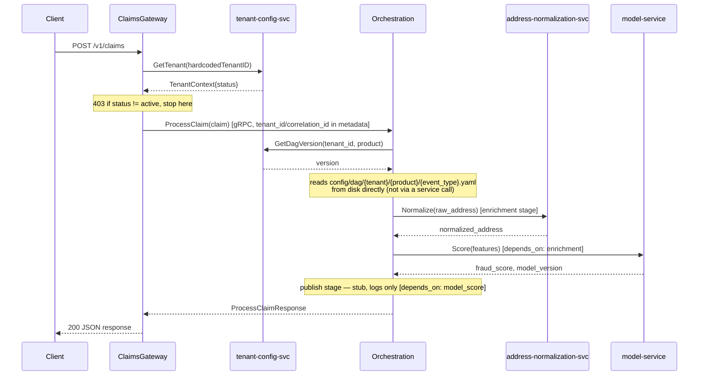

# Request → DAG call chain

Traces exactly what calls what for a single `POST /v1/claims`, file by file.
Useful alongside [config.go](../services/orchestration-service/internal/dag/config.go)/
[loader.go](../services/orchestration-service/internal/dag/loader.go)/
[executor.go](../services/orchestration-service/internal/dag/executor.go) —
those three answer "how does a DAG get shaped, loaded, and run"; this answers
"where does execution actually go, in order, across services."

## Sequence

## File-by-file

| Step | What happens | File |
|---|---|---|
| 1 | REST endpoint registered, dials downstream services | [cmd/gateway/main.go](../services/claims-gateway/cmd/gateway/main.go) |
| 2 | `SubmitClaim` handler entry point; generates `correlation_id` | [handler/claims.go](../services/claims-gateway/internal/handler/claims.go) |
| 3 | `resolveTenant()` → gRPC call to tenant-config-svc; `403` if not `active` | [handler/claims.go](../services/claims-gateway/internal/handler/claims.go) → [client/tenantconfig.go](../services/claims-gateway/internal/client/tenantconfig.go) |
| 4 | `TenantConfigService.GetTenant` server-side, looks up in-memory store | [tenant-config-svc/internal/server/tenantconfig.go](../services/tenant-config-svc/internal/server/tenantconfig.go) → [internal/store/store.go](../services/tenant-config-svc/internal/store/store.go) |
| 5 | Forward to Orchestration over gRPC, `tenant_id`/`correlation_id` as metadata | [client/orchestration.go](../services/claims-gateway/internal/client/orchestration.go) |
| 6 | `ProcessClaim` server entry, reads `tenant_id` from metadata, calls the executor | [orchestration-service/internal/server/orchestration.go](../services/orchestration-service/internal/server/orchestration.go) |
| 7 | `Executor.Run` — loads the DAG, then runs it stage by stage | [internal/dag/executor.go](../services/orchestration-service/internal/dag/executor.go) |
| 8 | `Loader.Load` — resolves version via tenant-config-svc, reads the YAML file | [internal/dag/loader.go](../services/orchestration-service/internal/dag/loader.go) → [client/tenantconfig.go](../services/orchestration-service/internal/client/tenantconfig.go) |
| 9 | The DAG definition itself (data, not code) | `config/dag/{tenant_id}/{product}/{event_type}.yaml`, e.g. [config/dag/acme_insurance/auto/claim.fnol.yaml](../config/dag/acme_insurance/auto/claim.fnol.yaml) |
| 10 | YAML shape → Go structs (`Config`, `Node`) | [internal/dag/config.go](../services/orchestration-service/internal/dag/config.go) |
| 11 | Stage 1 (enrichment group): calls address normalization | [internal/dag/executor.go](../services/orchestration-service/internal/dag/executor.go) → [client/addressnorm.go](../services/orchestration-service/internal/client/addressnorm.go) → (Java) [grpc/AddressNormalizationGrpcService.java](../services/address-normalization-svc/src/main/java/io/redcell/addressnorm/grpc/AddressNormalizationGrpcService.java) → [AddressNormalizer.java](../services/address-normalization-svc/src/main/java/io/redcell/addressnorm/AddressNormalizer.java) |
| 12 | Stage 2 (`depends_on: [enrichment]`): calls Model Service | [internal/dag/executor.go](../services/orchestration-service/internal/dag/executor.go) → [client/model.go](../services/orchestration-service/internal/client/model.go) → (Go stub) [model-service/internal/server/model.go](../services/model-service/internal/server/model.go) |
| 13 | Stage 3 (`depends_on: [model_score]`): stub publish, logs only | [internal/dag/executor.go](../services/orchestration-service/internal/dag/executor.go) |
| 14 | Response built and returned up the chain | [orchestration-service/internal/server/orchestration.go](../services/orchestration-service/internal/server/orchestration.go) → [claims-gateway/internal/handler/claims.go](../services/claims-gateway/internal/handler/claims.go) |

## Notes

- Steps 3-4 and 6-13 are two separate gRPC hops (ClaimsGateway→Orchestration,
  Orchestration→{tenant-config-svc,address-norm,model}) — Orchestration is
  the only service that talks to tenant-config-svc *and* the enrichment/model
  services; ClaimsGateway only ever talks to tenant-config-svc and
  Orchestration.
- Step 9 is data, not code — to change what the DAG does, edit the YAML, not
  `executor.go`. Step 10 is the Go type the YAML is parsed into. Step 7/11-13
  is what actually walks that parsed `Config` and dispatches per node
  (`node.Service` string → concrete client call — see the `switch` blocks in
  `executor.go`).
- This trace is layer-2a's version — `DECISIONS.md` explains why the DAG
  loading here is un-cached, un-validated, and staged rather than
  topologically sorted.
